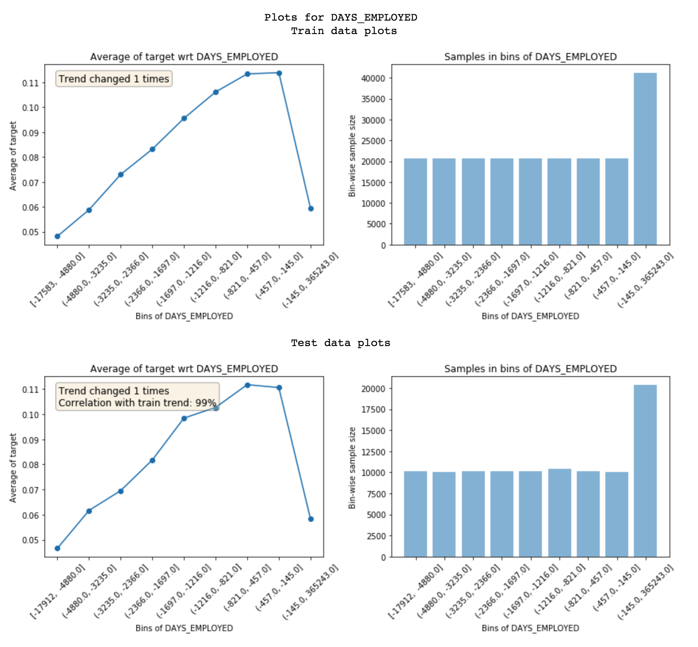
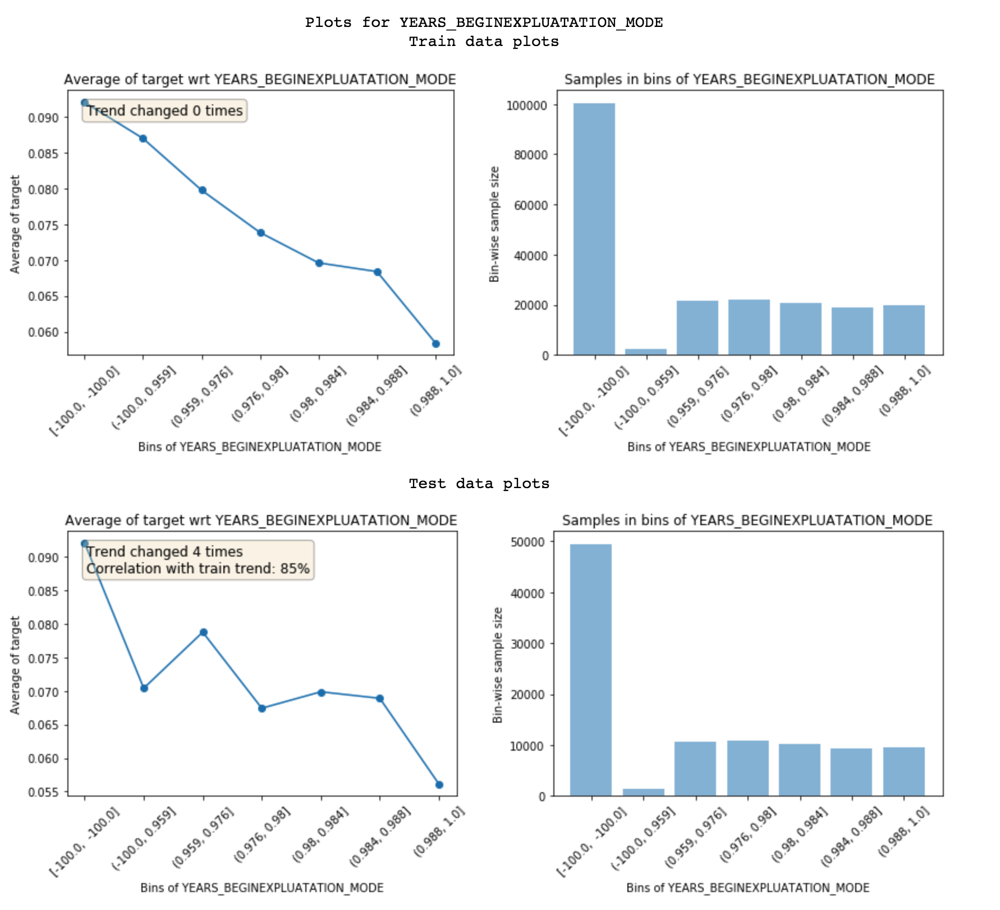
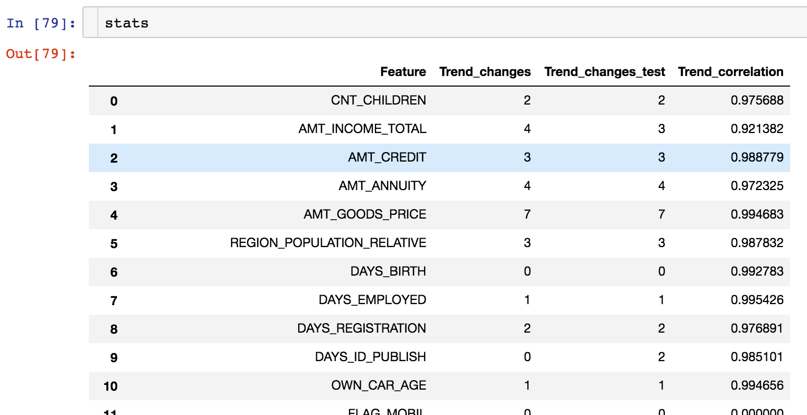
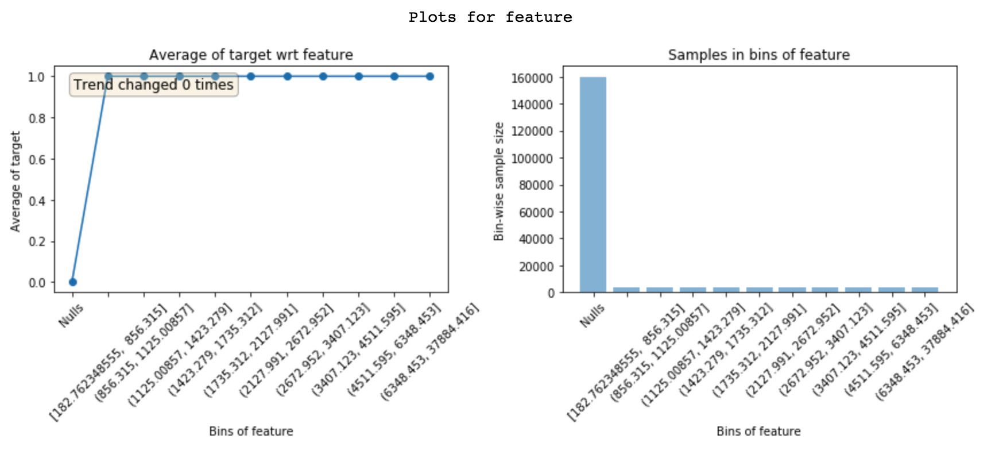

# featexp
Feature exploration for supervised learning. Helps with feature understanding, identifying noisy features, feature debugging, leakage detection and model monitoring.

### Installation
```pip install featexp```

### Using featexp
featexp draws plots similar to partial dependence plots, but directly from data instead of using a trained model like current implementations of pdp do. Since, it draws plots from data directly, it helps with understanding the features well and building better ML models.

```
from featexp import get_univariate_plots
get_univariate_plots(data=data_train, target_col='target', data_test=data_test, features_list=['DAYS_EMPLOYED'])

# data_test and features_list are optional. 
# Draws plots for all columns if features_list not passed
# Draws only train data plots if no test_data passed
```


featexp bins a feature into equal population bins and shows mean value of dependent variable (target) in each bin. Here's how to read these plots:
  1. Trend plot on left helps you understand the relationship between target and feature.
  2. Population distribution helps you make sure the feature is correct. 
  3. Also, shows number of trend direction changes and correlation between train and test trend which can be used to identify      noisy features. High number of trend changes or low trend correlation implies high noise.

Example of noisy feature: Has low trend correlation


### Getting binned feature stats
Returns mean target and population in each bin of a feature
```
from featexp import univariate_plotter
binned_data_train, binned_data_test = univariate_plotter(data=data_train, target_col='target', feature='DAYS_EMPLOYED', data_test=data_test)
# For only train data
binned_data_train = univariate_plotter(data=data_train, target_col='target', feature='DAYS_EMPLOYED')
```

### Getting stats for all features:
Returns trend changes and trend correlation for all features in a dataframe
```
from featexp import get_trend_stats_feature
stats = get_trend_stats(data=data_train, target_col='target', data_test=data_test)

# data_test is optional. If not passed, trend correlations aren't calculated.
```
Returns a dataframe with trend changes and trend correlation which can be used for dropping the noisy features, etc.


### Leakage detection
Helps with identifying why a feature is leaky which helps with debugging.


Nulls have 0% mean target and 100% mean target in other bins. Implies this feature is populated only for target = 1.

Blog post using featexp: https://towardsdatascience.com/my-secret-sauce-to-be-in-top-2-of-a-kaggle-competition-57cff0677d3c 
